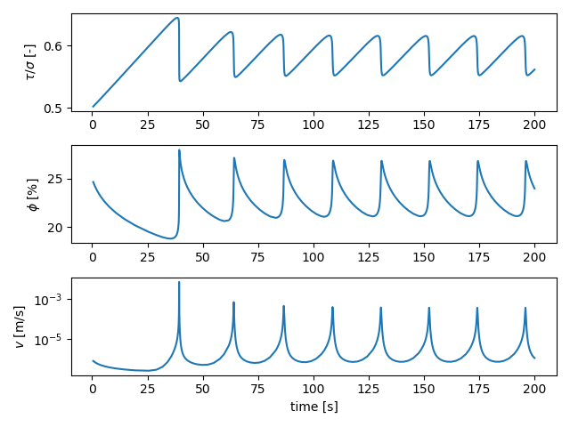
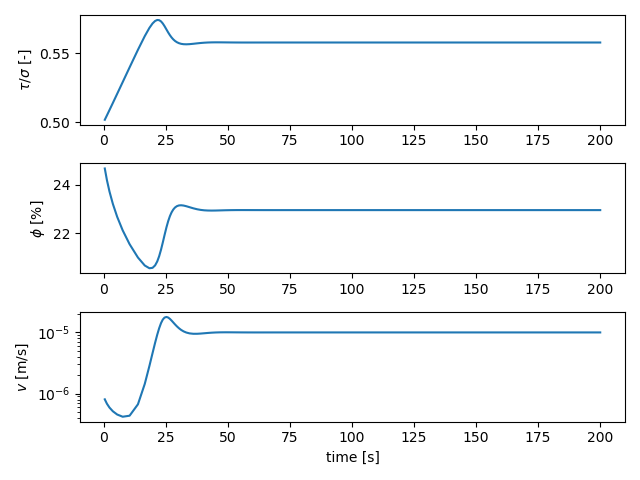

## CNS spring-block simulations

In this tutorial, we'll run a series of spring-block (1D fault) simulations with the _Chen-Niemeijer-Spiers_ (CNS) microphysical model. The corresponding Jupyter Notebook file is found in `examples/notebooks/CNS_spring-block.ipynb`. We start by importing the necessary libraries:

```python
# Make plots interactive in the notebook
%matplotlib notebook

import matplotlib.pyplot as plt
import numpy as np

# Import QDYN wrapper
from qdyn import qdyn
```

The simulation parameters are accessible after instantiation of the QDYN class as a Python dictionary object. We first define a number of global simulation parameters:

```python
# Instantiate the QDYN class object
p = qdyn()

# Get the settings dict
set_dict = p.set_dict

# Global simulation parameters
set_dict["MESHDIM"] = 0        # Simulation dimensionality (spring-block)
set_dict["TMAX"] = 200         # Maximum simulation time [s]
set_dict["NTOUT_OT"] = 1       # Save output every N steps
set_dict["V_PL"] = 1e-5        # Load-point velocity [m/s]
set_dict["MU"] = 2e9           # Shear modulus [Pa]
set_dict["VS"] = 0             # Turn of radiation damping
set_dict["SIGMA"] = 5e6        # Effective normal stress [Pa]
set_dict["ACC"] = 1e-7         # Solver accuracy
set_dict["SOLVER"] = 2         # Solver type (Runge-Kutta)

# To switch from rate-and-state friction ("RSF"; default) to the CNS model,
# we set the "FRICTION_MODEL" to "CNS"
set_dict["FRICTION_MODEL"] = "CNS"
```

We then overwrite the default values of specific rheological parameters:
```python
set_dict["SET_DICT_CNS"]["H"] = 0.5        # Dilatancy coefficient (higher = more dilatancy)
set_dict["SET_DICT_CNS"]["PHI_C"] = 0.3    # Critical state (maximum) porosity
set_dict["SET_DICT_CNS"]["A"] = [1e-10]    # Kinetic parameter of the creep mechanism
set_dict["SET_DICT_CNS"]["N"] = [1]        # Stress exponent of the creep mechanism

# Thickness of the (localised) gouge layer [m]
set_dict["SET_DICT_CNS"]["THICKNESS"] = 1e-4
# Initial shear stress [Pa]
set_dict["SET_DICT_CNS"]["TAU"] = 0.5 * set_dict["SIGMA"]
# Initial porosity [-]
set_dict["SET_DICT_CNS"]["PHI_INI"] = 0.25
```

Lastly, we pass the settings to the QDYN wrapper, generate the mesh (only 1 element) and write the `qdyn.in` input file:

```python
p.settings(set_dict)
p.render_mesh()
p.write_input()
```
The `p.write()` command writes a `qdyn.in` file to the current working directory, which is read by QDYN at the start of the simulation. To do this, call `p.run()`. Note that in this notebook, the screen output (`stdout`) is captured by the console, so you won't see any output here.
```python
p.run()
```

The simulation output is read and processed by the wrapper using:

```python
p.read_output()
```

The simulation time series output is then stored as a pandas `DataFrame` in `p.ot`. To see the behaviour of our spring-block fault, we can plot the time series of (normalised) shear stress, porosity, and slip velocity:

```python
plt.figure()

# Normalised shear stress
plt.subplot(311)
plt.plot(p.ot[0]["t"], p.ot[0]["tau"] / set_dict["SIGMA"])
plt.ylabel(r"$\tau / \sigma$ [-]")

# Porosity
plt.subplot(312)
plt.plot(p.ot[0]["t"], 100 * p.ot[0]["theta"])
plt.ylabel(r"$\phi$ [%]")

# Velocity
plt.subplot(313)
plt.plot(p.ot[0]["t"], p.ot[0]["v"])
plt.yscale("log")
plt.ylabel(r"$v$ [m/s]")
plt.xlabel("time [s]")

plt.tight_layout()
plt.show()
```


Note that the stick-slip cycles converge to a stable limit cycle, even in the absence of radiation damping. This is in contrast to classical rate-and-state friction, which does not exhibit stable limit cycles.

The stability of a fault governed by CNS rheology is very sensitive to the granular flow parameters, such as the dilatancy parameter $H$ (see _van den Ende et al._, [2018](https://doi.org/10.1016/j.tecto.2017.11.040)). By changing this value from 0.5 to 0.3, the fault stabilises at only deforms at steady-state:

```python
set_dict["SET_DICT_CNS"]["H"] = 0.3        # Updated dilatancy coefficient

# Write settings, run simulation
p.settings(set_dict)
p.render_mesh()
p.write_input()
p.run()
p.read_output()

# Plot time series
plt.figure()
plt.subplot(311)
plt.plot(p.ot[0]["t"], p.ot[0]["tau"] / set_dict["SIGMA"])
plt.ylabel(r"$\tau / \sigma$ [-]")

plt.subplot(312)
plt.plot(p.ot[0]["t"], 100 * p.ot[0]["theta"])
plt.ylabel(r"$\phi$ [%]")

plt.subplot(313)
plt.plot(p.ot[0]["t"], p.ot[0]["v"])
plt.yscale("log")
plt.ylabel(r"$v$ [m/s]")
plt.xlabel("time [s]")

plt.tight_layout()
plt.show()
```

